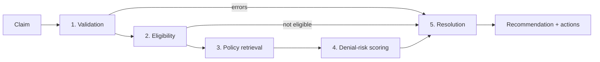

# Multi-Agent Claims Denial-Prevention System

A five-agent pipeline that checks a healthcare claim *before* submission and predicts whether the payer will deny it. It explains the risk and recommends fixes.

**Live demo:** https://claims-denial-prevention-agent.onrender.com/docs
(Free hosting: the first request after 15 idle minutes takes about a minute to wake up.)

> All data is synthetic. No real patient or payer data is used anywhere.

## Architecture



| Agent | What it does |
|---|---|
| Validation | Checks CPT and ICD-10 codes, payer, amounts, and dates |
| Eligibility | Checks member coverage dates, plan status, and payer |
| Policy retrieval | Finds the most relevant payer policy documents (TF-IDF retrieval) |
| Denial-risk scoring | XGBoost probability plus the top factors driving it |
| Resolution | Turns the analysis into a recommendation and concrete next steps |

Invalid or ineligible claims skip straight to Resolution, so no compute is spent scoring claims that cannot be submitted. The graph is built with LangGraph.

## Results

- Test AUC: **0.779** on a held-out 20% split of 5,000 synthetic claims (13.4% denial rate).
- Labels come from rules I wrote (missing prior authorization, out-of-network, late filing, diagnosis mismatch) plus noise, so this measures whether the model recovers those patterns, not real-world accuracy.

## Stack

FastAPI, LangGraph, XGBoost, scikit-learn, pandas, pydantic, pytest, Docker, GitHub Actions (tests on every push), deployed on Render.

## Run locally

```bash
python -m venv .venv && source .venv/bin/activate
pip install -r requirements.txt
python -m data.generate && python data/make_policies.py
python -m app.ml.train
python -m pytest -q
uvicorn app.api.main:app --reload   # http://127.0.0.1:8000/docs
```

On macOS, XGBoost needs `brew install libomp`.

## API

`POST /evaluate` takes a claim (`claim_id`, `member_id`, `payer`, `cpt_code`, `diagnosis_code`, `billed_amount`, `prior_auth_present`, `provider_in_network`, `days_to_filing`, `service_date`) and returns validation errors, eligibility, denial risk, risk factors, matching policies, a recommendation, and actions. `GET /health` is a liveness check.

## Design notes and limitations

- Retrieval uses TF-IDF, not embeddings, to fit a 512 MB free instance. The retrieval function is isolated in `app/rag/store.py` and can be swapped for a vector store.
- Shared feature code (`app/features.py`) is used by both training and inference, so the two cannot drift apart.
- The model is retrained at Docker build time, so no binary artifact is committed.
- Resolution logic is rule-based. An LLM step could be added to phrase recommendations.